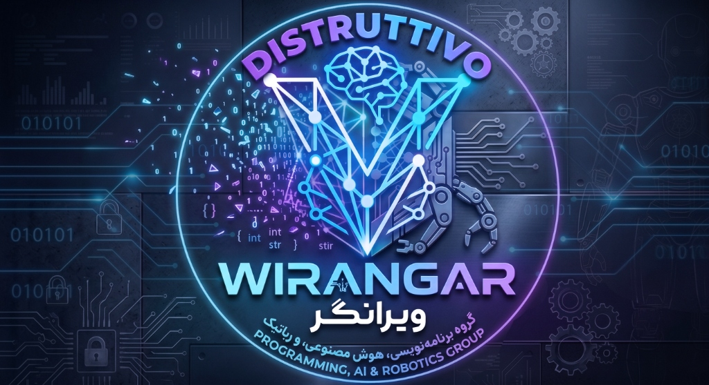

<div align="center">
  
</div>

<h1 align="center">Smart Studio AI</h1>

<p align="center">
  <strong>دستیار هوشمند شما برای ایده‌پردازی، تولید و مدیریت محتوا</strong>
</p>

## 🚀 معرفی
**Smart Studio** یک اپلیکیشن پیشرفته اندرویدی است که برای تسهیل فرآیند تولید محتوا در شبکه‌های اجتماعی (مانند اینستاگرام، تیک‌تاک، یوتیوب و...) طراحی شده است. این نرم‌افزار با بهره‌گیری از مدل‌های پیشرفته هوش مصنوعی (مانند **Google Gemini، OpenRouter و Groq**)، به عنوان یک دستیار خلاق همه‌جانبه در کنار شما عمل می‌کند.
از نوشتن سناریوهای جذاب تا رسم فلوچارت‌های استراتژیک، تولید تصاویر هوش مصنوعی، و تبدیل متن به گفتار (TTS)، همه‌چیز در این اپلیکیشن با بالاترین کیفیت و در یک رابط کاربری بسیار مدرن گنجانده شده است.

## 👑 توسعه‌دهنده: تیم ویرانگر
این نرم‌افزار با افتخار توسط **گروه برنامه‌نویسی و هوش مصنوعی ویرانگر (Wirangar Team)** به طور کامل طراحی و توسعه یافته است.
هدف اصلی ما در گروه ویرانگر، ترکیب طراحی مدرن UI/UX با کدهای بهینه بوده است تا ابزاری بسازیم که نیازهای واقعی تولیدکنندگان محتوا را با سرعت و دقتی باورنکردنی پاسخ دهد.

## 🌟 امکانات و قابلیت‌ها
کارهای انجام‌شده در این پروژه و قابلیت‌های اضافه‌شده عبارتند از:

- **🤖 تولید محتوای متنی پیشرفته:** دریافت کلمات کلیدی، لحن و پلتفرم از کاربر و ساخت اسکریپت‌ها و سناریوهای ویدیویی ساختاریافته توسط هوش مصنوعی (امکان انتخاب بین Gemini، OpenRouter و Groq).
- **🎭 پرسوناهای آماده (AI Personas):** انتخاب سریع پروفایل‌هایی نظیر "بلاگر تکنولوژی" یا "طنزپرداز" برای پر کردن خودکار فرم‌ها با لحن و پلتفرم مناسب.
- **🎨 تولید تصویر هوشمند (Pollinations.ai):** تولید کاورها و پوسترهای سینمایی خیره‌کننده با **نسبت ابعاد داینامیک** (مثلا ۱۶:۹ برای یوتیوب و ۹:۱۶ برای تیک‌تاک).
- **🎙️ دستیار صوتی و تبدیل متن به گفتار (TTS):** خواندن سناریوهای نوشته شده با صداهای قابل شخصی‌سازی و **قابلیت دانلود فایل صوتی (.wav)** به صورت محلی.
- **📊 فلوچارت‌های استراتژیک:** استخراج مراحل اجرای سناریو به صورت قدم‌به‌قدم و رسم خودکار فلوچارت‌های تعاملی در رابط کاربری اپلیکیشن.
- **🗣️ دستیار صوتی شناور (Voice Overlay):** یک دستیار صوتی که همه‌جا در اپلیکیشن در دسترس است. فرامین کاربر را با میکروفون ضبط کرده، به هوش مصنوعی فرستاده و پاسخ‌ها را برمی‌گرداند.
- **🌐 پشتیبانی کامل از بومی‌سازی (چندزبانه):** امکان تغییر زبان اپلیکیشن بین فارسی و انگلیسی در لحظه، همراه با راست‌چین شدن خودکار (RTL) تمامی المان‌ها.
- **💾 ذخیره‌سازی محلی پروژه‌ها:** استفاده از پایگاه داده قدرتمند برای ذخیره‌سازی تمامی پروژه‌های ساخته‌شده جهت دسترسی‌های بعدی به صورت آفلاین.
- **📱 رابط کاربری مدرن (Glassmorphism):** استفاده از المان‌های شیشه‌ای، رنگ‌بندی نئونی چشم‌نواز، سایه‌های نرم، انیمیشن‌های روان تغییر صفحه و افکت‌های تار (Blur) با استفاده از فناوری Jetpack Compose.

## 🛠️ تکنولوژی‌ها و معماری
تیم ویرانگر از به‌روزترین ابزارهای توسعه اندروید برای ساخت این اپلیکیشن استفاده کرده است:
- **زبان برنامه‌نویسی:** Kotlin
- **رابط کاربری:** Jetpack Compose (Material 3)
- **معماری:** MVVM + Clean Architecture + StateFlow
- **تزریق وابستگی:** Dagger Hilt
- **مدیریت پایگاه داده:** Room Database
- **ارتباطات شبکه‌ای:** Retrofit & Moshi
- **مدیریت تصاویر:** Coil-Compose
- **سرویس‌های هوش مصنوعی:** Google Gemini API, OpenRouter, Groq, Pollinations.ai

## ⚙️ راهنمای نصب و راه‌اندازی
برای اجرای این پروژه روی سیستم خود، مراحل زیر را دنبال کنید:
1. نرم‌افزار [Android Studio](https://developer.android.com/studio) را باز کرده و پوشه‌ی پروژه را `Open` کنید.
2. در مسیر اصلی پروژه (محل فایل `build.gradle.kts`) یک فایل به نام `.env` بسازید.
3. کلید API اختصاصی خود را در آن قرار دهید:
   ```env
   GEMINI_API_KEY=کلید_شما_در_اینجا
   ```
4. پروژه را سینک (Sync) کرده و سپس روی دستگاه یا شبیه‌ساز (Emulator) خود بیلد و اجرا کنید.

---
<p align="center">
  <b>توسعه یافته با نوآوری و قدرت توسط <a href="#">تیم ویرانگر (Wirangar)</a></b>
</p>

---

<h1 align="center">Smart Studio AI (English)</h1>

<p align="center">
  <strong>A powerful AI assistant for content ideation, generation, and management</strong>
</p>

## 🚀 Introduction
**Smart Studio** is an advanced Android application designed to facilitate the content creation process for social media platforms (like Instagram, TikTok, YouTube, etc.). By leveraging advanced AI models (such as **Google Gemini, OpenRouter, and Groq**), this software acts as an all-around creative assistant right by your side.
From writing engaging scripts to drawing strategic flowcharts, generating AI images, and converting text to speech (TTS), everything is provided in this application with the highest quality and in a highly modern user interface.

## 👑 Developer: Wirangar Team
This software was fully designed and developed with pride by the **Wirangar Programming and AI Team**.
Our main goal at Wirangar has been to combine modern UI/UX design with optimized code to create a tool that meets the real needs of content creators with incredible speed and precision.

## 🌟 Features & Capabilities
The work done in this project and the features added include:

- **🤖 Advanced Text Generation:** Receives keywords, tone, and platform from the user and builds structured video scripts and scenarios using AI (Gemini, OpenRouter, or Groq).
- **🎭 AI Personas:** Quick presets like "Tech Blogger" or "Comedian" to instantly fill forms with appropriate tones and platforms.
- **🎨 AI Image Generation:** Connects to Pollinations.ai to automatically generate cinematic posters and thumbnails with **Dynamic Aspect Ratios** (e.g., 16:9 for YouTube, 9:16 for TikTok).
- **🎙️ Text-to-Speech (TTS) & Audio Export:** Reads written scenarios using Android's native TTS engine with customizable voices, and includes an option to **Download audio files (.wav)** locally.
- **📊 Strategic Flowcharts:** Extracts step-by-step execution phases of the scenario and automatically draws interactive flowcharts in the app interface.
- **🗣️ Smart Voice Assistant (Voice Overlay):** A floating voice assistant available everywhere in the app. It records user commands via microphone, sends them to AI, and returns the responses.
- **🌐 Full Localization Support (Multilingual):** Ability to switch the app language between Persian and English instantly, along with automatic Right-to-Left (RTL) support for all elements.
- **💾 Local Project Storage:** Uses a powerful database to store all generated projects for future offline access.
- **📱 Modern UI (Glassmorphism):** Features glass-like elements, eye-catching neon color schemes, smooth navigation animations, and ambient blurs using Jetpack Compose technology.

## 🛠️ Technologies & Architecture
The Wirangar team has used the most up-to-date Android development tools to build this application:
- **Programming Language:** Kotlin
- **UI Toolkit:** Jetpack Compose (Material 3)
- **Architecture:** MVVM + Clean Architecture + StateFlow
- **Dependency Injection:** Dagger Hilt
- **Database Management:** Room Database
- **Network Communications:** Retrofit & Moshi
- **Image Management:** Coil-Compose
- **AI Services:** Google Gemini API, OpenRouter, Groq, Pollinations.ai

## ⚙️ Installation & Setup Guide
To run this project on your system, follow these steps:
1. Open [Android Studio](https://developer.android.com/studio) and `Open` the project folder.
2. In the root directory of the project (where the `build.gradle.kts` file is located), create a file named `.env`.
3. Place your dedicated API key in it:
   ```env
   GEMINI_API_KEY=your_api_key_here
   ```
4. Sync the project and then Build & Run it on your physical device or Emulator.

---
<p align="center">
  <b>Developed with innovation and power by the <a href="#">Wirangar Team</a></b>
</p>

---

<h1 align="center">Smart Studio AI (Italiano)</h1>

<p align="center">
  <strong>Un potente assistente AI per l'ideazione, la generazione e la gestione dei contenuti</strong>
</p>

## 🚀 Introduzione
**Smart Studio** è un'applicazione Android avanzata progettata per facilitare il processo di creazione di contenuti per le piattaforme di social media (come Instagram, TikTok, YouTube, ecc.). Sfruttando modelli AI avanzati (come **Google Gemini, OpenRouter e Groq**), questo software agisce come un assistente creativo a tutto tondo sempre al tuo fianco.
Dalla scrittura di script coinvolgenti al disegno di diagrammi di flusso strategici, dalla generazione di immagini AI alla conversione del testo in voce (TTS), tutto è fornito in questa applicazione con la massima qualità e in un'interfaccia utente altamente moderna.

## 👑 Sviluppatore: Team Wirangar
Questo software è stato interamente progettato e sviluppato con orgoglio dal **Team di Programmazione e AI Wirangar**.
Il nostro obiettivo principale in Wirangar è stato quello di combinare il design UI/UX moderno con un codice ottimizzato per creare uno strumento che soddisfi le reali esigenze dei creatori di contenuti con una velocità e precisione incredibili.

## 🌟 Funzionalità e Capacità
Il lavoro svolto in questo progetto e le funzionalità aggiunte includono:

- **🤖 Generazione Avanzata di Testi:** Riceve parole chiave, tono e piattaforma dall'utente e costruisce script video strutturati e scenari utilizzando l'IA (Gemini, OpenRouter o Groq).
- **🎭 AI Personas:** Preimpostazioni rapide come "Tech Blogger" per compilare automaticamente i moduli con il tono corretto.
- **🎨 Generazione di Immagini AI:** Si connette a Pollinations.ai per generare automaticamente poster e miniature cinematografiche con **Rapporti d'aspetto dinamici** (es. 16:9 per YouTube, 9:16 per TikTok).
- **🎙️ Sintesi Vocale (TTS) e Download Audio:** Legge gli scenari scritti utilizzando il motore nativo text-to-speech di Android, includendo un'opzione per il **Download dei file audio (.wav)**.
- **📊 Diagrammi di Flusso Strategici:** Estrae le fasi di esecuzione passo-passo dello scenario e disegna automaticamente diagrammi di flusso interattivi nell'interfaccia dell'app.
- **🗣️ Assistente Vocale Intelligente (Voice Overlay):** Un assistente vocale fluttuante disponibile ovunque nell'app. Registra i comandi dell'utente tramite microfono, li invia all'IA e restituisce le risposte.
- **🌐 Supporto Completo alla Localizzazione (Multilingue):** Possibilità di cambiare la lingua dell'app tra persiano e inglese istantaneamente, insieme al supporto automatico da destra a sinistra (RTL) per tutti gli elementi.
- **💾 Archiviazione Locale dei Progetti:** Utilizza un potente database per archiviare tutti i progetti generati per futuri accessi offline.
- **📱 UI Moderna (Glassmorphism):** Utilizza elementi simili al vetro, schemi di colori neon accattivanti, animazioni di navigazione fluide e sfocature ambientali utilizzando la tecnologia Jetpack Compose.

## 🛠️ Tecnologie e Architettura
Il team Wirangar ha utilizzato gli strumenti di sviluppo Android più aggiornati per costruire questa applicazione:
- **Linguaggio di Programmazione:** Kotlin
- **UI Toolkit:** Jetpack Compose (Material 3)
- **Architettura:** MVVM + Clean Architecture + StateFlow
- **Iniezione delle Dipendenze:** Dagger Hilt
- **Gestione del Database:** Room Database
- **Comunicazioni di Rete:** Retrofit & Moshi
- **Gestione delle Immagini:** Coil-Compose
- **Servizi AI:** Google Gemini API, OpenRouter, Groq, Pollinations.ai

## ⚙️ Guida all'Installazione e Configurazione
Per eseguire questo progetto sul tuo sistema, segui questi passaggi:
1. Apri [Android Studio](https://developer.android.com/studio) e clicca su `Open` per aprire la cartella del progetto.
2. Nella directory principale del progetto (dove si trova il file `build.gradle.kts`), crea un file chiamato `.env`.
3. Inserisci la tua chiave API dedicata:
   ```env
   GEMINI_API_KEY=inserisci_qui_la_tua_api_key
   ```
4. Sincronizza il progetto (Sync) e poi compila (Build) ed esegui (Run) sul tuo dispositivo fisico o emulatore.

---
<p align="center">
  <b>Sviluppato con innovazione e potenza dal <a href="#">Team Wirangar</a></b>
</p>
